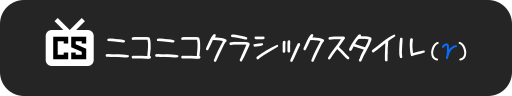
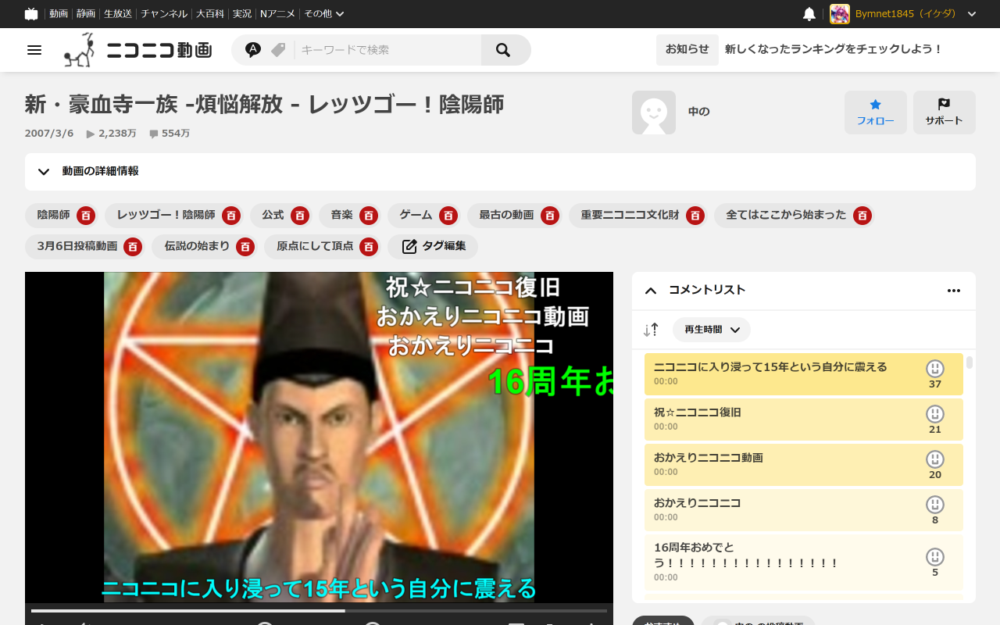
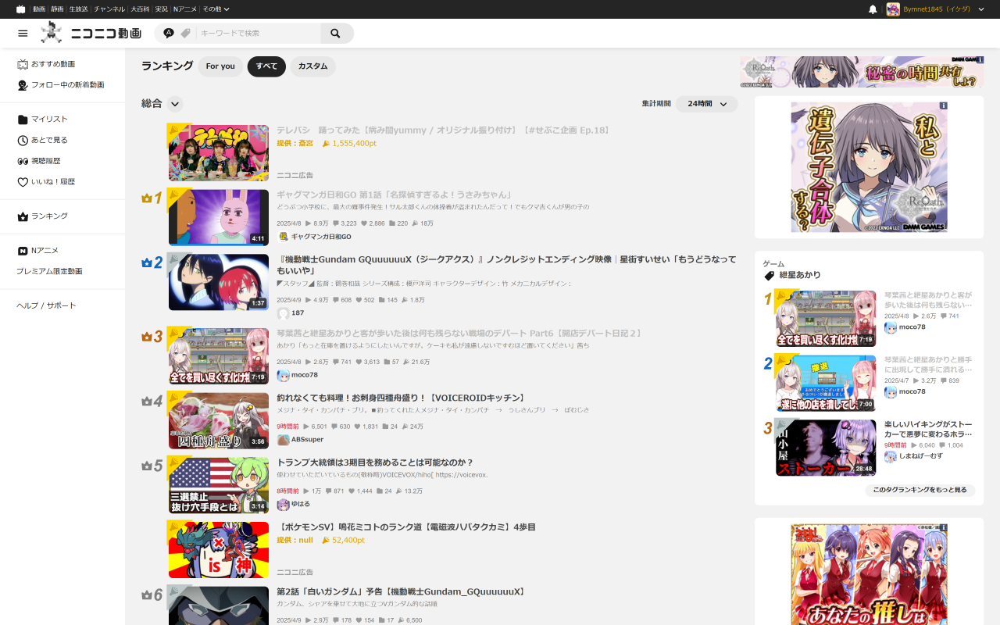

ニコニコの使い勝手を「帰ってきたニコニコ」になる前みたいな感じにしたりする、Mozilla Firefox向けの拡張機能です。

[Google Chrome／Microsoft Edge版](https://github.com/Bymnet1845/niconico-classic)も在ります。

## 主な機能

### 共通

- プロフィールアイコンの形状を、丸型から四角型に変更出来る様に成ります。
- ニコニコ動画の新しいヘッダーに左上を追加します。

### マイページ／ユーザーページ

- 新着タイムラインのサムネイルの大きさを、小さく出来る様に成ります。

### 動画ランキングページ

- サムネイルの大きさを、小さく出来る様に成ります。
- 共通ヘッダーや左サイドバーのメニューからのリンク先を、「For you」「総合」「カスタム」のどれかに固定出来る様に。
- ランキングの配置を、中央寄せに出来る様に成ります。

### 動画視聴ページ

- ページのレイアウトを「動画情報（タイトル、説明文、タグ等）が上、動画プレーヤーが下」へと戻せます。
- 動画の自動再生を無効に出来る様に成ります。
- たったワン・ステップでマイリストが使える「簡単マイリスト」機能が追加されます。
- 動画プレーヤーの映像の大きさを、ユーザーが任意に設定出来る様に成ります。
- 動画プレーヤーの映像の大きさを、最大1920x1080迄に拡大します。
- ページのスクロールが少なくても済む様に、「動画の詳細情報」をスリム化します。
- 動画記事、公開マイリスト一覧といったリニューアル後に未設置のリンクを、ページに追加します。
- タグのニコニコ大百科記事へのリンクを、新しいタブで開ける様に成ります。
- 動画プレーヤー操作時に映像部分にオーバレイ表示されるアイコンを、非表示に出来る様に成ります。

## 設定方法

1. アドレスバーの隣に在る拡張機能の一覧から、「ニコニコクラシックスタイル」を選択する。
2. 開かれたポップアップウィンドウから、設定を変更する。
3. ページを再読み込みすると、変更した設定が反映されます。

## 変更履歴

変更履歴は、[CHANGELOG.md](CHANGELOG.md)を御覧下さい。

## ライセンス

ライセンスは、[MITライセンス](LICENSE)です。